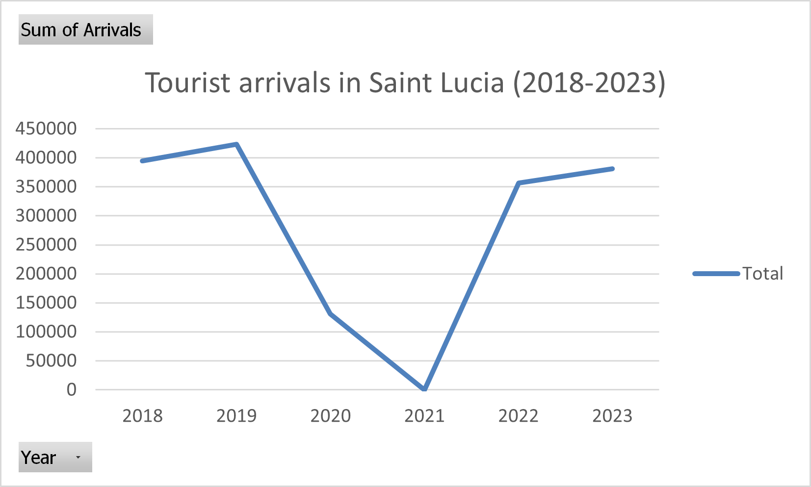
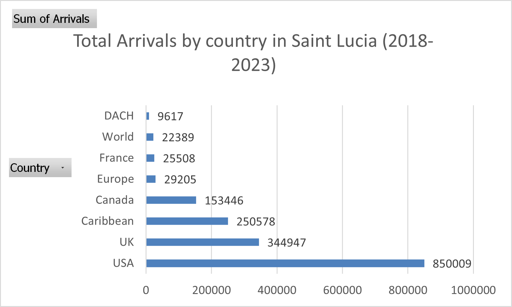
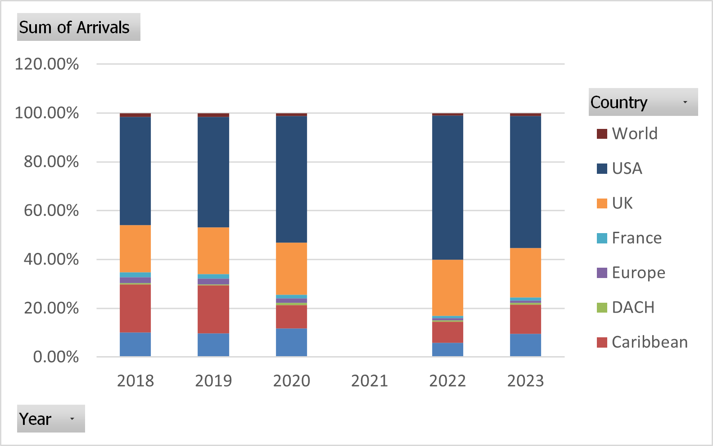

🇱🇨 Saint Lucia Tourism Data Analysis (2018–2023)

Overview

This project analyzes tourist arrivals in Saint Lucia by country of residence from 2018 to 2023. The goal is to identify key trends, evaluate market dependence, and assess the impact of COVID-19 on the tourism sector.

---

Key Insights

* Tourist arrivals peaked in 2019 before declining sharply in 2020 due to COVID-19
* The sector shows strong recovery by 2023, though not fully reaching pre-pandemic levels
* The United States is the dominant source market
* Tourism demand is highly concentrated, indicating potential vulnerability

---

Visualizations

Total Tourist Arrivals (2018–2023)

Tourist Arrivals by Country

Market Share by Country (%)

---

Files Included

* `report.pdf` – Full analysis report
* `tourism-data-cleaned.xlsx` – Cleaned dataset
* Charts used in analysis

---

Tools Used

* Microsoft Excel (Data Cleaning, Pivot Tables, Visualization)
* Power Query (Data Transformation)

---

Conclusion

The analysis highlights the resilience of Saint Lucia’s tourism sector while emphasizing its dependence on a limited number of source markets, particularly the United States.
